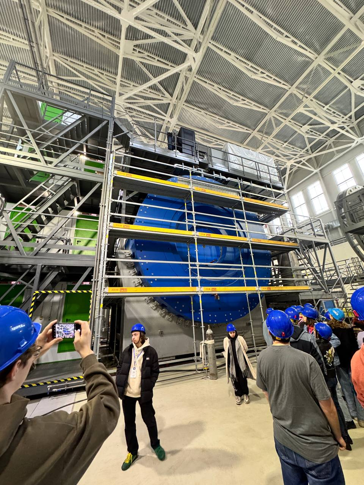
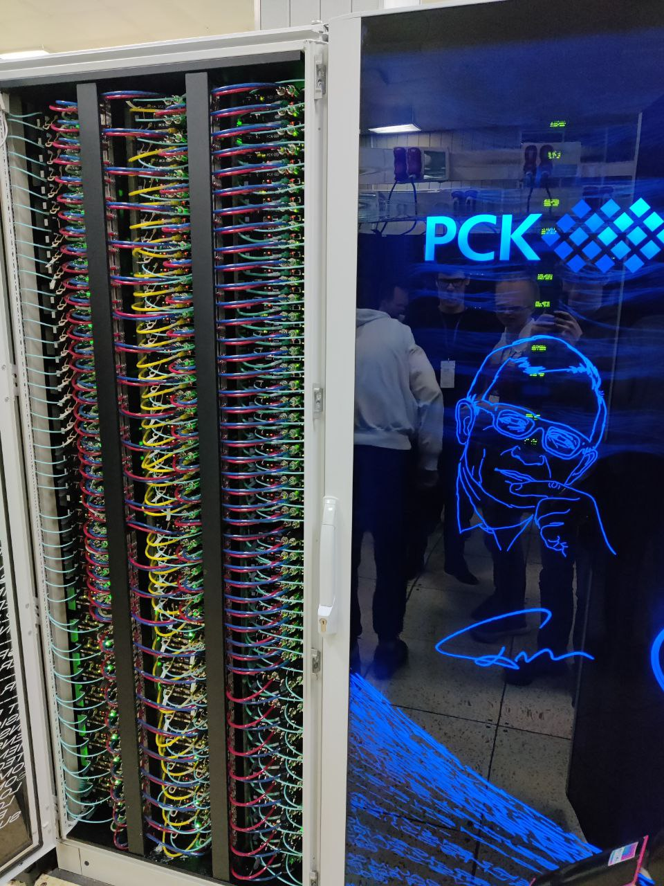
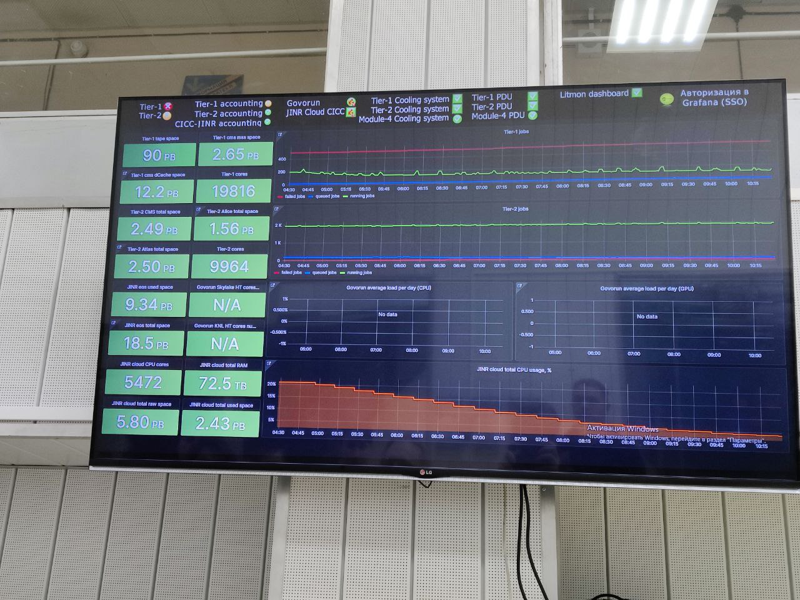
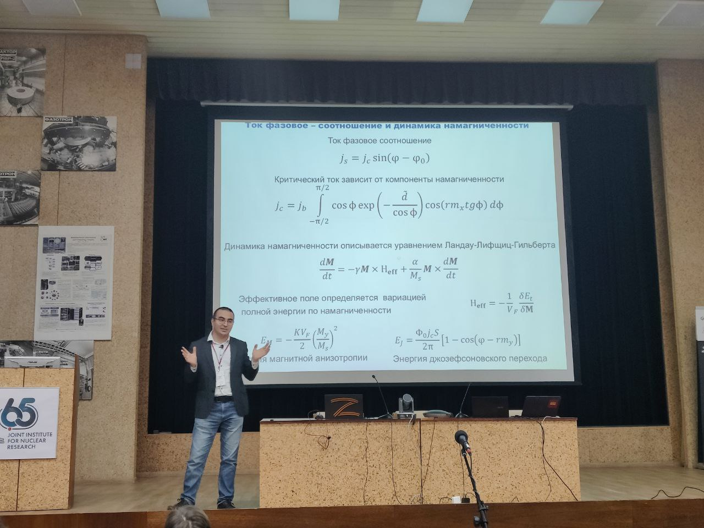

# Spring School on Information Technology at the Joint Institute for Nuclear Research (JINR)

## Overview

The **Spring School on Information Technology** is organized at the Joint Institute for Nuclear Research (JINR), located in Dubna, a city known for its scientific significance and picturesque location on the Volga River, 121 km from Moscow. JINR is a prestigious international intergovernmental organization known for integrating fundamental theoretical and experimental research with cutting-edge technologies. The school aims to provide students with practical knowledge and hands-on experience in advanced IT solutions tailored to support JINR's scientific projects.

JINR consists of seven laboratories, each comparable in scale to major academic institutes, and one of the key units is the **Laboratory of Information Technology (LIT)**. This laboratory focuses on providing computational, network, and information resources for scientific research across a wide spectrum of fields.

The school covers a broad range of topics, including distributed computing, high-performance systems, mathematical modeling, and digital ecosystems. By attending, students gain first-hand exposure to the tools and technologies used to solve challenges in cutting-edge scientific research.

## Topics Covered

Throughout the Spring School, students had the opportunity to explore a wide array of topics through lectures, practical sessions, and hackathons:

- **Data Processing in Heterogeneous Computing Environments**
- **Computing in High-Energy Physics**
- **Virtual Laboratory for High-Performance Computing**
- **Digital Ecosystem at JINR**
- **Repository of JINR Staff Publications**
- **Website and Web Service Development at JINR**
- **Status and Perspectives of JINR's Multifunctional Information and Computing Complex (MICC)**
- **Distributed Hierarchical Data Storage Systems**
- **Deep Reinforcement Learning**
- **Next-Generation IT Curriculums**
- **Model-Based Systems Engineering (MBSE) for IT Specialists**
- **Josephson Junction Modeling: Theory and Practice**
- **Big Data Analytics and Visualization Tools**
- **Machine Learning and Artificial Intelligence for Scientific Applications**
- **Finite Element Methods for Collective Atomic Nuclei Models**
- **Integral Equations in Particle Physics: Mathematical Formulation and Solutions**

Students were also involved in hands-on practical sessions, hackathons, and real-world projects, such as:

- **Hackathon on Big Data Analytics**
- **Josephson Junctions Modeling Hackathon**
- **Practical Work on Data Processing, Storage, and Visualization Tools**
- **Development of Programs for the MPD Experiment Data Analysis**
- **Distributed System for SPD Experiment Data Processing and Storage**
  
## Excursions and Visits

Participants also had the unique chance to tour JINR’s cutting-edge facilities:

- **Multifunctional Information and Computing Complex (MICC)**
- **NICA Accelerator Complex**
- **Interactive Exhibition on JINR’s Core Facilities**

These tours provided students with an in-depth look at the state-of-the-art infrastructure that supports the groundbreaking research carried out at JINR.

## Summary

The **Spring School on Information Technology at JINR** offered students a comprehensive overview of the latest trends and technologies in computing and IT, alongside the chance to apply these concepts in a real-world scientific setting. With a diverse range of lectures, hands-on activities, and excursions, participants gained invaluable experience in both theoretical knowledge and practical skills, all within the unique and inspiring atmosphere of one of the world's leading nuclear research institutes.

To learn more about the school and upcoming events, visit [itschool.jinr.ru](https://itschool.jinr.ru).

---

## Photos

